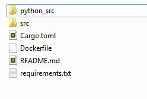
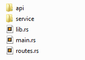
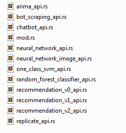

# ¿Qué es Rust?

# ¿Qué ventajas tienes?

* **Seguridad de memoria**

* **Rendimiento**

* **Concurrencia**

* **Recolector de basura**

# ¿Por qué usar Rust?

# Ejemplo de Hola Mundo

```Rust
fn main() {
	println!("Hola Mundo");
}
```

# Rust v/s Python

* **Rendimiento**

* **Seguridad de memoria**

* **Recolector de basura**

* **Concurrencia**

* **Sintaxis**

* **Aprendizaje**

# Instalación en Linux

```bash
curl -L https://github.com/pyenv/pyenv-installer/raw/master/bin/pyenv-installer | bash
```

```bash
export PYENV_ROOT="$HOME/.pyenv"
```

```bash
export PATH="$PYENV_ROOT/bin:$PATH"
```

```bash
eval "$(pyenv init -)"
```

```bash
pyenv global 3.12.3
```

```bash
pyenv versions
```

* **Output:**

> system (set by /home/user/.pyenv/version)
> 3.12.3

```bash
rustc --version
```

* **Output**

> rustc 1.79.0 (129f3b996 2024-06-10)


```bash
cargo --version
```

* **Output**

> rustc 1.79.0 (129f3b996 2024-06-10)


# ¿Qué es Cargo?

# ¿Crear un nuevo proyecto?

```bash
cargo new
```

* **Esto creará**

* Cargo.toml
* src/main.rs

# ¿Para que es el Cargo.toml y el main.rs?

# Explicacion del Código Rust





## ARCHIVO Cargo.toml

```
[package]
name = "rust-python"
version = "0.1.0"
edition = "2021"

# TODO: Limpiar bibliotecas que no se esten usando 
[dependencies]
reqwest = { version = "0.11", features = ["json"] }
axum = { version = "0.7.1", features = ["multipart"] }
chrono = { version = "0.4.31", features = ["serde"] }
once_cell = "1.19.0"
serde = { version = "1.0.193", features = ["derive"] }
serde_json = "1.0.108"
tokio = { version = "1.34.0", features = ["full"] }
dotenv = "0.15.0"
mongodb = "2.1"
bson = { version = "2", features = [
    "chrono-0_4",
] } # Needed for using chrono datetime in doc
base64 = "0.13.0"
tower-http = { version = "0.5.2", features = ["full"] }
tower = { version = "0.4", features = ["util"] }
soup = "0.5.1"


[dependencies.pyo3]
version = "0.22.0"
```

## ARCHIVO requirements.txt

```
numpy
pandas
scikit-learn
tensorflow
torch
nltk
joblib
matplotlib
pyro-ppl
dill
```

## Directorio src



## ARCHIVO src/main.rs

```Rust
mod api;
mod routes;
mod service;

use tokio::net::TcpListener;

#[tokio::main]
async fn main() {
    // Crear rutas para endpoints
    let app = routes::create_router();

    // Difinir la ip y el puerto
    let listener = TcpListener::bind("0.0.0.0:9005").await.unwrap();
    println!("INFO: Server started");

    // Ejecutar programa con Axum para exponer endpoints
    axum::serve(listener, app).await.unwrap();
}
```

## ARCHIVO src/lib.rs

```Rust
pub mod api;
pub mod service;
```

## ARCHIVO src/routes.rs

```Rust
use axum::{extract::DefaultBodyLimit, routing::post, Router};

use tower::ServiceBuilder;
use tower_http::trace::TraceLayer;

use crate::api::{
    arima_api::arima_api,
    bot_scraping_api::bot_scraping_api,
    chatbot_api::chatbot_api,
    neural_network_api::neural_network_api,
    neural_network_image_api::neural_network_image_api,
    one_class_svm_api::one_class_svm_api,
    random_forest_classifier_api::random_forest_classifier_api,
    recommendation_v1_api::recommendation_v1_api,
    recommendation_v2_api::recommendation_v2_api,
    recommendation_v0_api::recommendation_v0_api,
    replicate_api::{interior_design, mistral_llm_view, replicate_api},
};

// Crear rutas para cada endpoint
pub fn create_router() -> Router {
    // Variable para definir el limite maximo del body de una petición
    let body_limit = DefaultBodyLimit::max(50 * 1024 * 1024);

    // Endpoints
    Router::new()
        .route("/api/v1/arima", post(arima_api))
        .route("/api/v0/recommendation", post(recommendation_v0_api))
        .route("/api/v1/recommendation", post(recommendation_v1_api))
        .route("/api/v2/recommendation", post(recommendation_v2_api))
        .route("/api/v1/replicate", post(replicate_api))
        .route("/api/v1/replicate/mistral-llm/", post(mistral_llm_view))
        .route("/api/v1/replicate/interior-design/", post(interior_design))
        .route(
            "/api/v1/neural_network_image",
            post(neural_network_image_api),
        )
        .route("/api/v1/chatbot", post(chatbot_api))
        .route(
            "/api/v1/random_forest_classifier",
            post(random_forest_classifier_api),
        )
        .route("/api/v1/bot_scraping", post(bot_scraping_api))
        .route("/api/v1/neural_network", post(neural_network_api))
        .route("/api/v1/one_class_svm", post(one_class_svm_api))
        // Código para definir el limite máximo del body en una petición
        .layer(
            ServiceBuilder::new()
                .layer(body_limit)
                .layer(TraceLayer::new_for_http()),
        )
}
```

## Directorio src/api



## ARCHIVO src/api/mod.rs

```Rust
pub mod arima_api;
pub mod replicate_api;
pub mod neural_network_image_api;
pub mod recommendation_v0_api;
pub mod recommendation_v1_api;
pub mod chatbot_api;
pub mod random_forest_classifier_api;
pub mod bot_scraping_api;
pub mod neural_network_api;
pub mod one_class_svm_api;
pub mod recommendation_v2_api;
```


## ARCHIVO src/api/arima_api.rs

```Rust
use axum::extract::Multipart;
use axum::{http::StatusCode, response::IntoResponse};
use serde::Serialize;
use std::env;
use std::{fs, path::PathBuf};
use tokio::fs::File;
use tokio::io::AsyncWriteExt;

use crate::service::arima::arima_service;

#[derive(Serialize)]
struct ResponseBody {
    message: Option<String>,
}

pub async fn arima_api(mut multipart: Multipart) -> impl IntoResponse {

    // Crear varibales para guardar los campos
    let mut csv_file = Vec::new();
    let mut tabla_name = String::new();
    let mut num_predictions = String::new();

    // Obtener los campos recibidos
    while let Some(field) = multipart.next_field().await.unwrap() {
        let name = field.name().unwrap().to_string();
        match name.as_str() {
            "csv_file" => csv_file = field.bytes().await.unwrap().to_vec(),
            "tabla_name" => tabla_name = field.text().await.unwrap(),
            "num_predictions" => num_predictions = field.text().await.unwrap(),
            _ => (),
        }
    }

    // Obtener ruta del proyecto
    let project_dir = get_project_dir();

    // Crear rutas de los archivos necesarios
    let dir_path = format!(
        "{}/python_src/arima",
        project_dir
    );

    // Crear directorio si no existe
    if !PathBuf::from(&dir_path).exists() {
        fs::create_dir_all(&dir_path).unwrap();
    }

    // Almacenar csv para la predicción
    let csv_file_path = format!("{}/python_src/arima/file.csv", &project_dir);
    let mut file;
    file = match File::create(&csv_file_path).await {
        Ok(file) => {
            file
        },
        Err(e) => {
            println!("Error en crear csv");
            let response = ResponseBody {
                message: Some(format!("Error al crear csv {}", e)),
            };
            return (StatusCode::NOT_FOUND, axum::Json(response));
        },
    };
    file.write_all(&csv_file).await.unwrap();

    // Hacer predicción con modelo de python
    let _output = arima_service(csv_file_path, tabla_name, num_predictions);

    // Devolver la respuesta exitosa
    let response = ResponseBody {
        message: Some("<<<< Predicción Completada >>>>".to_string()),
    };
    (StatusCode::OK, axum::Json(response))
}

fn get_project_dir() -> String {
    env!("CARGO_MANIFEST_DIR").to_string()
}
```

## Directorio src/service


## ARCHIVO src/service/mod.rs

```Rust
pub mod arima;
pub mod replicate;
pub mod neural_network_image;
pub mod recommendation_v0;
pub mod recommendation_v1;
pub mod chatbot;
pub mod random_forest_classifier;
pub mod bot_scraping;
pub mod neural_network;
pub mod one_class_svm;
pub mod recommendation_v2;
```

## ARCHIVO src/service/arima.rs

```Rust
use std::{
  fs,
  path::{Path, PathBuf},
};
use pyo3::{
  types::{PyAnyMethods, PyList, PyListMethods, PyModule},
  Py, PyAny, PyErr, PyResult, Python,
};

pub fn arima_service(csv_file_path:String, table_name:String, num_predictions:String) -> Result<(), PyErr> {
	let output = pyhon_execute(csv_file_path,table_name,num_predictions,);
    println!("{:?}", output);
    output
}

fn pyhon_execute(csv_file_path:String, table_name:String, num_predictions:String) -> Result<(), PyErr> {
	pyo3::prepare_freethreaded_python();
	let project_dir = get_project_dir();
	let full_path = build_path(&project_dir, &["python_src", "arima"])
		.display()
		.to_string();
	let path = Path::new(&full_path);
	let py_app = fs::read_to_string(path.join("main.py"))?;
	let from_python = Python::with_gil(|py| -> PyResult<Py<PyAny>> {
		let syspath = py
			.import_bound("sys")?
			.getattr("path")?
			.downcast_into::<PyList>()?;
		syspath.insert(0, &path)?;
		let app: Py<PyAny> = PyModule::from_code_bound(py, &py_app, "", "")?
			.getattr("run")?
			.into();
		println!("num_predictions {:?}", num_predictions);
		app.call1(py, (csv_file_path, table_name,num_predictions))
	});
	let result = format!("{}", from_python?);
	println!("{}", result); 
	Ok(())
}

fn get_project_dir() -> String {
    env!("CARGO_MANIFEST_DIR").to_string()
}

fn build_path(base: &str, parts: &[&str]) -> PathBuf {
    let mut path = PathBuf::from(base);
    for part in parts {
        path.push(part);
    }
    path
}
```


## Directorio python_src


## ARCHIVO python_src/arima/main.py

```python
import matplotlib.pyplot as plt
import torch as pt
import numpy as np
import datetime, time, os
import pandas as pd
import math
import dill
from functools import wraps, partial
import pyro
from pyro import distributions, poutine
from pyro.nn import PyroSample, PyroModule, pyro_method, PyroParam
from pyro.infer import Importance, Trace_ELBO,WeighedPredictive, MHResampler
from pyro.infer.importance import vectorized_importance_weights
from pyro.ops.stats import quantile, energy_score_empirical
from pyro.distributions import TransformedDistribution, Normal, LogNormal, MultivariateNormal, LKJCholesky
from torch.distributions.transforms import ExpTransform, AffineTransform, ComposeTransform
from torch.distributions.constraints import independent, real
from io import BytesIO
from typing import NamedTuple, Any
from functools import partial

ModuleList = PyroModule[pt.nn.ModuleList]

import doctest
doctest.testmod()

@pt.jit.script
def calc_arma_transform_core(x, x_is_in_not_out, input, output, i_coefs, o_coefs, drift):
    i_coefs = i_coefs[..., :-1]
    o_coefs = o_coefs[..., :-1]
    input = input[..., (-i_coefs.shape[-1]):]
    output = output[..., (-o_coefs.shape[-1]):]
    ret_val = []
    for n in range(x.shape[-1]):
        next_x = x[..., n][..., None]
        if x_is_in_not_out[n]:
            next_val = next_x + ((input  * i_coefs).sum(-1) - \
                                 (output * o_coefs).sum(-1))[..., None] + drift
            input  = pt.cat([input[..., 1:],  next_x], dim=-1)
            output = pt.cat([output[..., 1:], next_val], dim=-1)
        else:
            next_val = next_x + ((output * o_coefs).sum(-1) - \
                                 (input  * i_coefs).sum(-1))[..., None] - drift
            input  = pt.cat([input[..., 1:],  next_val], dim=-1)
            output = pt.cat([output[..., 1:], next_x], dim=-1)
        ret_val.append(next_val)
    return pt.cat(ret_val, dim=-1)

def calc_arma_transform(x, x_is_in_not_out, input, output, i_coefs, o_coefs, drift):
    assert(x_is_in_not_out.shape==x.shape[-1:])
    input = input[[None] * (len(x.shape) - len(input.shape)) + [Ellipsis]].expand(*(x.shape[:-1] + (input.shape[-1],)))
    output = output[[None] * (len(x.shape) - len(output.shape)) + [Ellipsis]].expand(*(x.shape[:-1] + (output.shape[-1],)))
    return calc_arma_transform_core(x, x_is_in_not_out, input, output, i_coefs, o_coefs, drift)

class ARMATransform(pt.distributions.transforms.Transform):
    domain = independent(real, 1)
    codomain = independent(real, 1)
    bijective = True

    def __init__(self, i_tail, o_tail, i_coefs, o_coefs, drift, x=None, idx=None, x_is_in_not_out=None):
        super().__init__()
        self.i_tail, self.o_tail, self.i_coefs, self.o_coefs, self.drift = i_tail, o_tail, i_coefs, o_coefs, drift
        self.x, self.idx, self.x_is_in_not_out = x, idx, x_is_in_not_out
        if x_is_in_not_out is not None:
            if not x_is_in_not_out[idx].all():
                raise UserWarning('Inputs must be innovations.')
    
    def log_abs_det_jacobian(self, x, y):
        return x.new_zeros(x.shape[:(-1)]) 

    def get_x(self, x):
        x_is_in_not_out = pt.tensor([True] * (x if self.x is None else self.x).shape[-1]) if self.x_is_in_not_out is None else self.x_is_in_not_out.clone()
        if self.x is not None:
            x_clone = self.x.clone()
            x_clone[..., self.idx] = x
            x = x_clone
        return x, x_is_in_not_out

    def _call(self, x):
        x, x_is_in_not_out = self.get_x(x)
        x = calc_arma_transform(x, x_is_in_not_out, self.i_tail, self.o_tail, self.i_coefs, self.o_coefs, self.drift)
        if self.x is not None:
            x = x[..., self.idx]
        return x

    def _inverse(self, x):
        x, x_is_in_not_out = self.get_x(x)
        x_is_in_not_out = ~x_is_in_not_out
        if self.x is not None:
            x_is_in_not_out[self.idx] = ~x_is_in_not_out[self.idx]
            x_is_in_not_out = ~x_is_in_not_out
        x = calc_arma_transform(x, x_is_in_not_out, self.i_tail, self.o_tail, self.i_coefs, self.o_coefs, self.drift)
        if self.x is not None:
            x = x[..., self.idx]
        return x

class Polynomial(pt.nn.Module):
    def __init__(self, coefs=None):
        super().__init__()
        self.coefs = coefs
    
    def get_coefs(self):
        return self.coefs
    
    def get_params(self):
        return []

    def __mul__(self, other):
        return TwoPolynomialOperation(self, other, 'Multiply')

    def __pow__(self, power):
        retval = Polynomial(pt.Tensor([1.0]))
        for count in range(power):
            retval = retval * self
        return retval

class TwoPolynomialOperation(Polynomial):
    def __init__(self, first_poly, second_poly, operation):
        super().__init__()
        self.first_poly = first_poly
        self.second_poly = second_poly
        self.operation = operation

    def get_coefs(self):
        if self.operation == 'Multiply':
            # Do polynomial multiplication
            first_poly_coefs = self.first_poly.get_coefs()
            second_poly_coefs = self.second_poly.get_coefs()
            coefs = pt.zeros(len(first_poly_coefs) + len(second_poly_coefs) - 1)
            for n, coef in enumerate(first_poly_coefs):
                temp = pt.zeros(len(first_poly_coefs) + len(second_poly_coefs) - 1)
                temp[n:(n+len(second_poly_coefs))] = coef * second_poly_coefs
                coefs = coefs + temp
            return coefs
        else:
            raise ('Operation {} no esta soportada.'.format(self.operation))
        
    def get_params(self):
        return list(set(self.first_poly.get_params() + self.second_poly.get_params()))

class BiasOnePolynomial(Polynomial):
    def __init__(self, n, multiplicity=1):
        super().__init__()
        self.n = n
        self.multiplicity = multiplicity
        self.bias = pt.tensor(1.0)
        self.coefs = pt.nn.Parameter(pt.zeros(n))

    def get_coefs(self):
        coefs = pt.zeros(1 + len(self.coefs) * self.multiplicity)
        coefs[0] = self.bias
        coefs[self.multiplicity::self.multiplicity] = self.coefs
        return coefs

    def get_params(self):
        return [self.coefs] if self.n > 0 else []

def IntegratorPolynomial(n, multiplicity=1):
    coefs = pt.zeros(1 + multiplicity)
    coefs[0] = 1.0
    coefs[-1] = -1.0
    return Polynomial(coefs) ** n
    
def PD(p, d, multiplicity=1):
    return BiasOnePolynomial(p, multiplicity) * IntegratorPolynomial(d, multiplicity)

def taylor(f, n=pt.inf, origin=0.0):
    x = pt.nn.Parameter(pt.tensor(origin))
    series = [f(x)]
    count = 1
    while count < n:
        grad = pt.autograd.grad(series[-1], x, create_graph=True)[0] / count
        if grad.grad_fn is None:
            break
        else:
            series.append(grad)
        count += 1
    return series

def IndexIndependent(Innovations):
    class IndexIndependentInnovations(Innovations):
        def forward(self, samples_idx):
            try:
                num_samples = len(samples_idx)
            except TypeError:
                num_samples = samples_idx
            return super().forward(num_samples)
    return IndexIndependentInnovations


@IndexIndependent
class NormalInnovations(PyroModule):
    def __init__(self, sigma_prior_dist=LogNormal, sigma_prior_dist_params=dict(loc=0, scale=5)):
        super().__init__()
        self.sigma_prior = sigma_prior_dist(**sigma_prior_dist_params)
        self.sigma = PyroSample(self.sigma_prior)

    def shape(self, num_event_samples):
        return self.sigma.shape + (num_event_samples,)

    def slice(self, event_samples_idx):
        return (Ellipsis, event_samples_idx)

    def forward(self, num_samples):
        return Normal(                    pt.zeros(self.sigma.shape + (num_samples,)),
                      self.sigma[..., None].expand(self.sigma.shape + (num_samples,))).to_event(1)


@IndexIndependent
class NormalInnovationsVector(PyroModule):
    def __init__(self, n, sigma_prior_dist=LogNormal, sigma_prior_dist_params=dict(loc=0, scale=5)):
        super().__init__()
        self.sigma_prior = sigma_prior_dist(**sigma_prior_dist_params).expand((n,)).to_event(1)
        self.sigma = PyroSample(self.sigma_prior)

    def shape(self, num_event_samples):
        return self.sigma.shape[:-1] + (num_event_samples, self.sigma.shape[-1])

    def slice(self, event_samples_idx):
        return (Ellipsis, event_samples_idx, slice(None))

    def forward(self, num_samples):
        return Normal(pt.zeros(self.sigma.shape[:-1] + (num_samples, self.sigma.shape[-1])),
                      self.sigma[..., None, :].expand(self.sigma.shape[:-1] +
                                                       (num_samples, self.sigma.shape[-1]))).to_event(2)

@IndexIndependent
class MultivariateNormalInnovations(PyroModule):
    def __init__(self, n, sigma_prior_dist=LogNormal, sigma_prior_dist_params=dict(loc=0, scale=5)):
        super().__init__()
        self.sigma_prior = sigma_prior_dist(**sigma_prior_dist_params).expand((n,)).to_event(1)
        def modified_model_guide(*ignore_args, **ignore_kwargs):
            trace = poutine.trace(poutine.block(guide, hide=guide_block_nodes)).get_trace()
            return poutine.block(poutine.replay(model, trace=trace), hide=set(trace.nodes).union(model_block_nodes))(*args, **kwargs)
        self.model = model
        self.guide = guide
        self.guide_block_nodes = guide_block_nodes
        self.model_block_nodes = model_block_nodes
        self.modified_model_guide = modified_model_guide

    def __call__(self, *args, **kwargs):
        return self.modified_model_guide(*args, **kwargs)

load = partial(pt.load, pickle_module=dill)
save = partial(pt.save, pickle_module=dill)

def clone(model):
    buffer = BytesIO()
    save(model, buffer)
    buffer.seek(0)
    return load(buffer)

class MixtureGuide(PyroModule):
    def __init__(self, guide, model, n_components, args=tuple(), kwargs=dict(), init_fn=None):
        super().__init__()
        self.guide_list = ModuleList()
        for n_component in range(n_components):
            self.guide_list.append(guide(model))
            self.guide_list[-1](*args, **kwargs)
            if init_fn is not None:
                init_fn(self.guide_list[-1], n_component)

    def __call__(self, *args, **kwargs):
        alpha = pyro.param('alpha', pt.zeros(len(self.guide_list))).exp()
        idx = pyro.sample('idx', distributions.Categorical(alpha / sum(alpha)),
                           infer={'enumerate': 'sequential', 'is_auxiliary': True})
        self.guide_list[idx](*args, **kwargs)

def make_params_pyro(module, param_names=[], dist_class=distributions.Normal, dist_params=dict(loc=0, scale=5)):
    for child_module in module.children():
        pyro.nn.module.to_pyro_module_(child_module)
    parameters = [*module.parameters()]
    pyro_parameters = [PyroSample(dist_class(**dist_params).expand(param.shape).to_event(len(param.shape)))
                       if name not in param_names else         
                       PyroParam(param) for name, param in module.named_parameters()]
    update_list = []
    for child_module in module.modules():
        for name, param in child_module.named_parameters(recurse=False):
            idx = min([n for n, p in enumerate(parameters) if p is param])
            update_list.append((child_module, name, pyro_parameters[idx]))
    for child_module, name, pyro_param in update_list:
        delattr(child_module, name)
        setattr(child_module, name, pyro_param)

class Transform():
    def forward(self, observations, *args, **kwargs):
        return self.get_transform(*args, **kwargs).inv(observations)
    
    def predict(self, innovations, *args, **kwargs):
        return self.get_transform(*args, **kwargs)(innovations)

class ARIMA(Transform, pt.nn.Module):
    def __init__(self, p, d, q, ps, ds, qs, s, drift=False, i_tail_type='zero', o_tail_type='full', output_transforms=[]):
        super().__init__()
        self.PD = PD(p, d)
        self.Q = BiasOnePolynomial(q)
        self.PDS = PD(ps, ds, s)
        self.QS = BiasOnePolynomial(qs, s)
        self.output_transforms = output_transforms
        o_coefs = list((self.PD * self.PDS).get_coefs())[::-1]
        o_grad_params = self.PD.get_params() + self.PDS.get_params()
        self.o_grads, self.o_hesss = calc_grads_hesss(o_coefs, o_grad_params, o_grad_params[1:])
        self.o_coefs = pt.cat([o_coef[None] for o_coef in o_coefs]).detach().clone()
        i_coefs = list((self.Q * self.QS).get_coefs())[::-1]
        i_grad_params = self.Q.get_params() + self.QS.get_params()
        self.i_grads, self.i_hesss = calc_grads_hesss(i_coefs, i_grad_params, i_grad_params[1:])
        self.i_coefs = pt.cat([i_coef[None] for i_coef in i_coefs]).detach().clone()
        self.drift = pt.nn.Parameter(pt.zeros(1)) if drift else pt.zeros(1)
        self.i_tail = get_tail(i_tail_type, s, self.i_coefs)
        self.o_tail = get_tail(o_tail_type, s, self.o_coefs)
        
    def get_transform(self, x=None, idx=None, x_is_in_not_out=None):
        o_params = self.PD.get_params() + self.PDS.get_params()
        o_coefs = self.o_coefs
        for o_grad, o_param in zip(self.o_grads, o_params):
            o_coefs = o_coefs + pt.matmul(o_grad, o_param[...,None])[...,0]
        for o_hess, o_left, o_right in zip(self.o_hesss, o_params, o_params[1:]):
            o_coefs = o_coefs + pt.matmul(pt.matmul(o_left[..., None, None, :], o_hess), o_right[..., None, :, None])[..., 0, 0]

        i_params = self.Q.get_params() + self.QS.get_params()
        i_coefs = self.i_coefs
        for i_grad, i_param in zip(self.i_grads, i_params):
            i_coefs = i_coefs + pt.matmul(i_grad, i_param[..., None])[...,0]
        for i_hess, i_left, i_right in zip(self.i_hesss, i_params, i_params[1:]):
            i_coefs = i_coefs + pt.matmul(pt.matmul(i_left[..., None, None, :], i_hess), i_right[..., None, :, None])[..., 0, 0]

        if x_is_in_not_out is not None:
            x = x.clone()
            x[..., ~x_is_in_not_out] = ComposeTransform(self.output_transforms).inv(x[..., ~x_is_in_not_out])

        i_tail = replicate_to_length(self.i_tail, i_coefs.shape[-1] - 1)
        o_tail = replicate_to_length(self.o_tail, o_coefs.shape[-1] - 1)
        
        return ComposeTransform([ARMATransform(i_tail, o_tail,
                                               i_coefs, o_coefs, self.drift,
                                               x, idx, x_is_in_not_out)] + self.output_transforms)

class VARIMA(Transform, pt.nn.Module):
    def __init__(self, arimas):
        super().__init__()
        self.arimas = pt.nn.ModuleList(arimas)

class BayesianTimeSeries(PyroModule):
    def __init__(self, model, innovations, obs_idx, predict_idx):
        super().__init__()
        self.model = model
        make_params_pyro(self)
        self.innovations_dist = innovations
        self.set_indices(obs_idx, predict_idx)

    def set_indices(self, obs_idx, predict_idx):
        self.obs_idx = [*obs_idx]
        self.predict_idx = [*predict_idx]
        if set(self.obs_idx).union(set(self.predict_idx)) != \
           set(range(len(self.obs_idx) + len(self.predict_idx))):
            raise UserWarning('Indices of observations and predictions must be complementary.')
        self.predict_innovations = PyroSample(lambda self: self.innovations_dist(self.predict_idx))
        self.observations = PyroSample(lambda self: self.observations_dist())
        return self

    def innovations(self):
        innovations = pt.empty(self.innovations_dist.shape(len(self.obs_idx) + len(self.predict_idx))).fill_(pt.nan)
        innovations[self.innovations_dist.slice(self.predict_idx)] = self.predict_innovations
        is_innovation = pt.zeros(len(self.obs_idx) + len(self.predict_idx), dtype=pt.bool)
        is_innovation[self.predict_idx] = True
        return innovations, is_innovation

    def observations_dist(self):
        combined, is_innovation = self.innovations()
        transform = self.model.get_transform(x=combined, idx=self.obs_idx)
        return TransformedDistribution(self.innovations_dist(self.obs_idx), [transform])

    def forward(self):
        return self.observations
        
    @pyro_method
    def predict(self):
        combined, is_innovation = self.innovations()
        combined[self.innovations_dist.slice(self.obs_idx)] = self.observations
        transform = self.model.get_transform(x=combined, idx=self.predict_idx, x_is_in_not_out=is_innovation)
        combined[self.innovations_dist.slice(self.predict_idx)] = transform(combined[self.innovations_dist.slice(self.predict_idx)])
        return combined

def timeit(func=None, name=None, time_format=':.2f'):
    if func is None:
        return partial(timeit, name=name, time_format=time_format)
    @wraps(func)
    def timeit_wrapper(*args, **kwargs):
        start_time = time.perf_counter()
        result = func(*args, **kwargs)
        end_time = time.perf_counter()
        total_time = end_time - start_time
        return result
    return timeit_wrapper

def load_data(file,t):
    data = pd.read_csv(file)
    year = np.arange(1, len(data[t]) + 1)
    observations = pt.Tensor(data[t])
    return year, observations

def cross_validation_folds(data, test_ratio_or_num, num_folds, train_ratio=1.0):
    num_samples = len(data)
    num_test_samples = round(num_samples * test_ratio_or_num) if test_ratio_or_num < 1 else test_ratio_or_num
    num_train_samples = round((num_samples - num_test_samples) * train_ratio)
    num_fold_samples = num_train_samples + num_test_samples
    for fold_num in range(num_folds):
        start_idx = round(fold_num / (num_folds - 1) * (num_samples - num_fold_samples))
        all_idx = [*range(start_idx, start_idx + num_fold_samples)]
        test_start_idx = start_idx + round(fold_num / (num_folds - 1) * num_train_samples)
        test_idx = [*range(test_start_idx, test_start_idx + num_test_samples)]
        train_idx = [idx for idx in all_idx if idx not in test_idx]
        train_idx = [idx - start_idx for idx in train_idx]
        test_idx = [idx - start_idx for idx in test_idx]
        yield data[all_idx], train_idx, test_idx, start_idx

def calc_grads_hesss(coefs, grad_params, hess_params):
    grads = []
    hesss = []
    for n, grad_param in enumerate(grad_params):
        grads.append([])
        if n < len(hess_params):
            hesss.append([])
        for coef in coefs:
            grads[-1].append(pt.autograd.grad(coef, grad_param, create_graph=True)[0])
            if n < len(hess_params):
                hesss[-1].append([])
                for g in grads[-1][-1]:
                    hesss[-1][-1].append(pt.autograd.grad(g, hess_params[n], create_graph=True)[0])
    grads = [pt.stack(grad).detach().clone() for grad in grads]
    hesss = [pt.stack([pt.stack(h) for h in hess]).detach().clone() for hess in hesss]
    return grads, hesss

def replicate_to_length(x, length, dim=-1):
    shape = list(x.shape)
    if shape[dim] == length:
        return x
    elif shape[dim] > length:
        raise UserWarning('Length shorter than input at specified dimension.')
    else:
        sizes = [1] * len(shape)
        sizes[dim] = math.ceil(length / shape[dim])
        x = x.repeat(*sizes)
        select = [slice(None)] * len(shape)
        select[dim] = slice(length)
        return x[select]

def get_tail(tail_type, s, coefs):
    if tail_type == 'zero':
        return pt.zeros(len(coefs) - 1)
    elif tail_type == 'full':
        return pt.nn.Parameter(pt.zeros(len(coefs) - 1))
    elif tail_type == 'seasonal':
        return pt.nn.Parameter(pt.zeros(s))
    else:
        return pt.nn.Parameter(pt.zeros(tail_type))

def BayesianARIMA(*args, obs_idx, predict_idx, innovations=NormalInnovations, **kwargs):
    return BayesianTimeSeries(ARIMA(*args, **kwargs), innovations(), obs_idx, predict_idx)

def BayesianVARIMA(*args, n, obs_idx, predict_idx, innovations=MultivariateNormalInnovations, **kwargs):
    return BayesianTimeSeries(VARIMA([ARIMA(*args, **kwargs) for i in range(n)]), innovations(n), obs_idx, predict_idx)

def create_model(obs_idx, num_predictions, observations, model_args=(3, 0, 1, 0, 1, 2, 12)):
    predict_idx = [*range(max(obs_idx) + 1 + num_predictions)]
    predict_idx = [idx for idx in predict_idx if idx not in obs_idx]
    mean_log = observations.log().mean()
    std_log = observations.log().std()
    output_transforms = [AffineTransform(loc=mean_log, scale=std_log), ExpTransform()]
    return BayesianARIMA(*model_args,
                         obs_idx=obs_idx, predict_idx=predict_idx,
                         output_transforms=output_transforms)

@timeit
def fit(model,
        lr_sequence=[(0.005, 20),
                     (0.010, 20)] * 1 +
                    [(0.005, 20),
                     (0.001, 20)],
        loss=pyro.infer.JitTrace_ELBO,
        loss_params=dict(num_particles=20, vectorize_particles=True, ignore_jit_warnings=True)):
    guide = pyro.infer.autoguide.guides.AutoMultivariateNormal(model)
    guide()
    guide.loc.data[:] = 0
    guide.scale_unconstrained.data[:] = -5
    loss = loss(**loss_params)
    for lr, num_iter in lr_sequence:
        optimizer = pyro.optim.Adam(dict(lr=lr))
        svi = pyro.infer.SVI(model, guide, optimizer, loss=loss)
        for count in range(num_iter):
            svi.step()
    return guide

def run(file,tabla,num_predictions):
    print("Script Ejecutado")
    num_predictions = int(num_predictions)
    year, observations = load_data(file,tabla)
    obs_idx = range(len(observations))
    model = create_model(obs_idx, num_predictions, observations)
    conditioned_model = pyro.poutine.condition(model, data={'observations': observations[model.obs_idx]})
    conditioned_predict = pyro.poutine.condition(model.predict, data={'observations': observations[model.obs_idx]})
    guide = fit(conditioned_model)
    num_samples = 30000
    predictive = WeighedPredictive(conditioned_predict,
                                   guide=guide,
                                   num_samples=num_samples,
                                   parallel=True,
                                   return_sites=('_RETURN',))
    resampler = MHResampler(predictive)
    while resampler.get_total_transition_count() < num_samples:
        samples = resampler(model_guide=conditioned_model)
        samples = samples.samples['_RETURN']
    confidence_interval = [0.05, 0.95]
    plt.figure()
    plt.plot(year[model.obs_idx], observations[model.obs_idx], 'b', label='Observaciones')
    all_year = np.concatenate((year, year[-1] + (np.arange(len(model.obs_idx) + len(model.predict_idx) - len(year)) + 1) * np.diff(year).mean()))
    idx = sorted(set(np.clip([min(model.predict_idx) - 1, max(model.predict_idx) + 1] + model.predict_idx, 0, len(all_year) - 1)))
    ci = quantile(samples[:,idx], confidence_interval)
    plt.fill_between(all_year[idx], ci[0], ci[1], color='r', alpha=0.5, label='Estimaciones al 90% CI')
    plt.xlabel('Rango')
    plt.ylabel('Valor')
    plt.title('Estadística')
    plt.legend(loc='upper left')
    plt.grid()
    output_file_name = '00.png'
    plt.savefig(output_file_name)
    print('Ajustando el modelo a los datos y mostrando predicciones')
    #########################################################
    ratios = (0.6 ** np.arange(4))[::-1]
    models = []
    indices = []
    guides = []
    samples = []
    for ratio in ratios:
        n = len(observations)
        indices.append(range(round((1 - ratio)*n), n))
        models.append(create_model([*range(len([*indices[-1]]))], num_predictions, observations[indices[-1]]))
        conditioned_model = pyro.poutine.condition(models[-1], data={'observations': observations[indices[-1]]})
        conditioned_predict = pyro.poutine.condition(models[-1].predict, data={'observations': observations[indices[-1]]})
        guides.append(fit(conditioned_model))
        predictive = WeighedPredictive(conditioned_predict,
                                       guide=guides[-1],
                                       num_samples=num_samples,
                                       parallel=True,
                                       return_sites=("_RETURN",))
        resampler = MHResampler(predictive)
        while resampler.get_total_transition_count() < num_samples:
            sample = resampler(model_guide=conditioned_model).samples['_RETURN']
        samples.append(sample)
    plt.figure()
    spans = np.array(ratios) * (max(year) - min(year))
    colors = ['r', 'g', 'b', 'y'][::-1]
    cis = []
    one_year_mean_ci = []
    five_year_mean_ci = []
    median = []
    for span, idx, model, sample, color in zip(spans, indices, models, samples, colors):
        cis.append(quantile(sample, confidence_interval))
        ci = cis[-1][..., model.predict_idx]
        plt.fill_between(all_year[min(idx):][model.predict_idx], ci[0], ci[1],
                         label='Estimador de {:.1f} Rango de Datos Observados a un 90% CI'.format(span), color=color, alpha=0.5)
        one_year_mean_ci.append((ci[1]-ci[0])[:12].mean())
        five_year_mean_ci.append((ci[1]-ci[0]).mean())
        median.append(quantile(sample, [0.5])[0, model.predict_idx])
    plt.xlabel('Rango')
    plt.ylabel('Valor')
    plt.title('Predicciones con Diferentes Rangos de Datos Observados')
    plt.legend(loc='lower left')
    plt.grid()
    output_file_name = '01.png'
    plt.savefig(output_file_name)
    plt.figure()
    plt.plot(spans, one_year_mean_ci, 'bo-', label='Un Rango Significa 90% CI')
    plt.plot(spans, five_year_mean_ci, 'ro-', label='Cinco Rangos Significan 90% CI')
    plt.xlabel('Rango de Datos Observados')
    plt.ylabel('90% CI')
    plt.title('Estimador 90% CI vs Rango de Datos Observados')
    plt.legend(loc='upper left')
    plt.grid()
    output_file_name = '02.png'
    plt.savefig(output_file_name)
    print('Mostrando efecto de la cantidad de datos de capacitación sobre predicciones')
    ####################################
    num_folds = 5
    missing_models = []
    missing_guides = []
    missing_samples = []
    error = False
    for obs, train_idx, test_idx, start_idx in cross_validation_folds(observations, num_predictions, num_folds):
        if train_idx:
            missing_models.append(create_model(train_idx, len(observations) - max(train_idx) - 1, obs[train_idx]))
            conditioned_model = pyro.poutine.condition(missing_models[-1], data={'observations': obs[train_idx]})
            conditioned_predict = pyro.poutine.condition(missing_models[-1].predict, data={'observations': obs[train_idx]})
            missing_guides.append(fit(conditioned_model))
            predictive = WeighedPredictive(conditioned_predict,
                                           guide=missing_guides[-1],
                                           num_samples=num_samples,
                                           parallel=True,
                                           return_sites=("_RETURN",))
            resampler = MHResampler(predictive)
            while resampler.get_total_transition_count() < num_samples:
                sample = resampler(model_guide=conditioned_model).samples['_RETURN']
            missing_samples.append(sample)
        else:
            error=True
            break
    
        for n, (missing_model, missing_ci) in enumerate(zip(missing_models, missing_cis)):
            plt.subplot(num_folds, 1, n+1)
            plt.fill_between(year[missing_model.predict_idx],
                             missing_ci[0], missing_ci[1], color='r', alpha=0.5)
            plt.plot(year, observations, 'b')
            plt.grid()
            plt.ylabel('Valor')
            if n == 0:
                plt.title('Predicción de muestras faltantes arbitrarias a 90% de IC')
            if n < (num_folds - 1):
                plt.gca().xaxis.set_tick_params(labelbottom=False)
        plt.xlabel('Rango')
        output_file_name = '03.png'
        plt.savefig(output_file_name)
        print('Mostrando predicciones de datos faltantes')
        plt.figure()
        plt.subplot(2, 1, 1)
        plt.plot(100 * np.linspace(0, 1, num_folds), missing_mean_cis, 'bo-')
        plt.xlabel('Cantidad de datos antes de la primera muestra faltante [%]')
        plt.ylabel('Significa 90% CI')
        plt.title('Estimador CI al 90% VS Ubicación de muestras faltantes')
        plt.grid()
        plt.subplot(2, 1, 2)
        plt.plot(100 * np.linspace(0, 1, num_folds), missing_energy_score, 'ro-')
        plt.xlabel('Cantidad de datos antes de la primera muestra faltante [%]')
        plt.ylabel('Puntuación')
        plt.title('Puntuación de energía de muestras faltantes frente a la ubicación de muestras faltantes')
        plt.grid()
        plt.tight_layout()
        output_file_name = '04.png'
        plt.savefig(output_file_name)
    print('== FINALIZADO ==')
```

## Solicitud endpoint usando requests

```Python
import requests

url = "http://localhost:9005/api/v1/arima" #sustituir por la ip del servidor 

file = open('file.csv', 'rb')
payload = {
    "tabla_name": "Tabla01",
    "num_predictions": "60"
}

response = requests.post(url, data=payload, files={'csv_file': file})

print(response.status_code)
print(response.text)
```

## Flujo de trabajo

* Solicitud endpoint
* Archivo api/arima_api.rs
* Archivo service/arima.rs
* Archivo python_src/arima/main.py
* Retornar output en el sentido contrario

## Forma simplificada de ejecutar python desde Rust

* **src/main.rs**

```Rust
//use pyo3::prelude::*;
use std::{
  fs,
  path::{Path, PathBuf},
};
use pyo3::{
  types::{PyAnyMethods, PyList, PyListMethods, PyModule},
  Py, PyAny, PyErr, PyResult, Python,
};

fn main() -> Result<(), PyErr> {
  pyo3::prepare_freethreaded_python();
  let project_dir = get_project_dir();
  let full_path = build_path(&project_dir, &["python_folder", "script"])
    .display()
    .to_string();
  let path = Path::new(&full_path);
  let py_app = fs::read_to_string(path.join("main.py"))?;
  let from_python = Python::with_gil(|py| -> PyResult<Py<PyAny>> {
    let syspath = py
      .import_bound("sys")?
      .getattr("path")?
      .downcast_into::<PyList>()?;
    syspath.insert(0, &path)?;
    let app: Py<PyAny> = PyModule::from_code_bound(py, &py_app, "", "")?
      .getattr("main")?
      .into();
    app.call1(py, ("Hola Python", 18))
  });
  let result = format!("{}", from_python?);
  println!("{}", result); 
  Ok(())
}

fn get_project_dir() -> String {
    env!("CARGO_MANIFEST_DIR").to_string()
}

fn build_path(base: &str, parts: &[&str]) -> PathBuf {
    let mut path = PathBuf::from(base);
    for part in parts {
        path.push(part);
    }
    path
}
```


* **python_folder/script/main.py**

```python
def main(name,value):
	print(name,value)
```